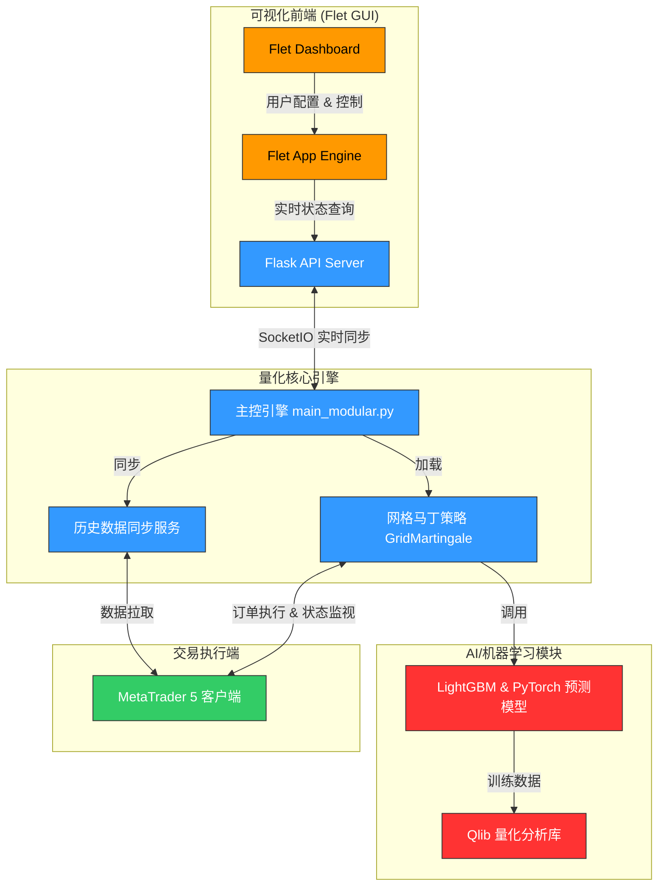

# 🪙 NeuralQuant Pro (神经网络量化交易系统)

[](https://www.python.org/)
[](https://flet.dev/)
[](https://pytorch.org/)
[](https://github.com/microsoft/qlib)
[](https://www.mql5.com/)

**NeuralQuant Pro** 是一款专为黄金（`XAUUSD`）交易打造的 AI 驱动型高频/网格智能量化交易系统。该系统基于 **MetaTrader 5 (MT5)** 平台，结合深度学习（PyTorch）、机器学习（LightGBM）及微软量化平台 Qlib 进行信号预测与策略优化，并配备了现代化的 **Flet (Flutter for Python)** 跨平台可视化交互界面。

---

## 🗺️ 系统架构

系统采用模块化与微服务设计，包含数据同步、策略引擎、风控守护以及可视化前端：



---

## ✨ 核心特性

- ⚡ **MT5 原生毫秒级集成**：基于 `MetaTrader5` 原生 API，实现超低延迟的行情获取与多空双向订单执行。
- 🤖 **AI 与传统策略融合**：支持将传统网格、马丁格尔策略与深度学习（PyTorch/LightGBM）信号进行混合，过滤震荡与趋势行情，提供更智能的开仓方向指引。
- 🛡️ **分级保证金防御机制**：
  - `Margin Level < 500%`：自动冻结高层级（`L13-L18`）新开仓，仅允许基础层级运行。
  - `Margin Level < 350%`：全系统冻结一切新开仓动作，仅允许平仓与减仓。
  - `Margin Level < 250%`：触发硬风控保护，强制执行全套平仓退出。
- 💸 **已实现利润池联动（Profit Pool Recycling）**：
  - 动态反向冲抵：利用 `L14/L15` 等级已实现的盈余利润，定向部分削减高风险层级（如 `L16`）的深套头寸，逐步收敛持仓风险带宽。
- 📊 **现代化仪表盘**：采用 Flet（基于 Flutter）构建的现代化暗黑/明亮自适应 GUI，直观展示实时浮动盈亏、点差保护状态、资金曲线和分级持仓分布。

---

## 📈 黄金顺势保守策略 (Gold Trend Conservative)

系统内置的黄金顺势保守策略主要用于 `XAUUSD` 美分账户，旨在“先控风险，再要利润”。

### 1. 核心运行参数

| 参数项 | 配置设定 | 作用说明 |
| :--- | :--- | :--- |
| **交易品种** | `XAUUSD` / `XAUUSD.c` | 现货黄金（美分账户最佳） |
| **单轮硬止损** | `-1000` 美分 | 触发后立即整轮退出，绝不抗单 |
| **常规利润目标** | `+120 ~ +260` 美分 | 达到后迅速落袋为安，开启新轮次 |
| **L16 应急重入限制** | 最多 `2-3` 次 | 防止极端单边行情下盲目补仓 |

### 2. 主序列开仓级数表

第 1 笔和第 2 笔采用**双发硬规则**，以降压并加速盈利离场；后续各层级按级数精准递增：

| 层级 (Level) | 单笔手数 (Lots) | 下单数量 (Count) | 备注 |
| :--- | :---: | :---: | :--- |
| **L1** | 0.01 | **2 (双发)** | 起始主方向仓位 |
| **L2** | 0.02 | **2 (双发)** | 顺势/回调加仓 |
| **L3** | 0.03 | 1 | 步入常规马丁区间 |
| **L4 - L6** | 0.04 - 0.05 | 1 | L4 起允许触发动态反向对冲单 |
| **L7 - L12** | 0.06 - 0.11 | 1 | 受 `Margin Level < 500%` 保护 |
| **L13 - L15** | 0.11 - 0.15 | 1 | 利润优先补充进已实现利润池 |
| **L16** | 0.18 | 1 | 触发 **Module A** 保险单机制 |
| **L17 - L18** | 0.20 - 0.22 | 1 | 终极极限层级 |

---

## 🛠️ 技术栈

- **GUI 交互界面**：`Flet` (Flutter for Python), `flet-charts`
- **数据可视化**：`Plotly`, `Kaleido`
- **量化与模型预测**：`pyqlib` (微软 AI 量化平台), `lightgbm`, `PyTorch` (用于时序网络预测), `scikit-learn`
- **数据处理**：`pandas`, `numpy`
- **通讯与网络**：`Flask`, `flask-socketio`, `requests`, `flask-cors`
- **交易接口**：`MetaTrader5` 官方 Python SDK
- **AI 助理**：`openai` SDK (集成大模型做智能策略分析与行情报告总结)

---

## 🚀 快速开始

### 1. 环境依赖配置

首先，请确保您的运行环境为 **Windows OS**（MT5 API 仅支持 Windows 系统）。

进入 `quant_app` 目录并安装所需 Python 包：

```bash
cd quant_app
# 推荐使用虚拟环境 (venv)
python -m venv venv
venv\Scripts\activate

# 安装依赖
pip install -r requirements.txt
```
*(或者直接双击运行 `quant_app/install_requirements.bat`)*

### 2. 启动策略引擎 (CLI)

策略引擎以模块化方式启动，可以通过环境变量来配置激活的策略与参数预设：

```bash
# 激活策略预设，默认运行 GridMartingaleMA02
set ACTIVE_STRATEGY=GridMartingaleMA02
set ACTIVE_PRESET=conservative_gold

python -m quant_app.main_modular
```

### 3. 启动可视化客户端 (Flet GUI)

如需启动前台仪表盘查看实时持仓、图表和收益统计：

```bash
python run_flet.py
```

### 4. 项目打包部署

项目已配置 PyInstaller 打包环境，可以通过 `NeuralQuantPro.spec` 进行编译打包：

```bash
pyinstaller NeuralQuantPro.spec
```
编译成功后，将在 `dist` 目录中生成无需 Python 环境的绿色版可执行文件。

---

## 📁 目录结构说明

```text
NeuralQuant-Pro/
├── quant_app/                  # 核心应用源码
│   ├── ui/                     # Flet UI 组件与界面布局
│   ├── core/                   # 核心基础服务 (MT5连接、历史同步、日志)
│   │   ├── mt5_client.py       # MT5 底层客户端封装
│   │   └── history_sync_service.py # 历史行情与账户状态同步
│   ├── modules/                # 策略与核心算法模块
│   │   └── strategies/         # 交易策略实现
│   │       ├── grid_martingale_ma01/
│   │       └── grid_martingale_ma02/
│   ├── assets/                 # 静态资源 (图标、音效、样式)
│   └── requirements.txt        # 项目依赖列表
├── run_flet.py                 # 可视化前台启动入口
├── NeuralQuantPro.spec         # PyInstaller 打包规范文件
├── gold_m1_history.csv         # 黄金 1 分钟历史回测数据
└── gold_trend_conservative_plan.md # 顺势保守策略执行细则文档
```

---

## ⚠️ 免责声明 (Risk Disclaimer)

本系统仅用于量化交易学术研究与技术演示。金融市场（尤其是黄金 `XAUUSD` 等杠杆衍生品交易）具有极高的风险性，历史回测业绩并不代表未来实际收益。用户因使用或配置本系统所导致的任何资金亏损，由使用者本人自行承担，项目作者及贡献者对此不承担任何法律责任。交易有风险，入市需谨慎。
